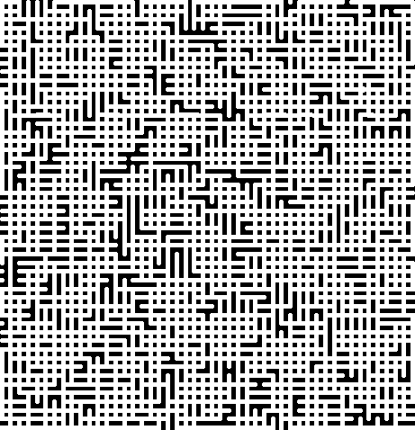

# Maze
Creating Maze using Wilson's Algorithm

Still Working...

Wilson's Algorithm:
1.  Choose a random cell and add it to the visited list
2.  Choose another random cell (Don’t add to visited list). This is the current cell
3.  Choose a random cell that is adjacent to the current cell (Don’t add to visited list). This is your new current cell.
4.  Save the direction that you traveled on the previous cell
5.  If the current cell is not in the visited cells list
        Go to 3
6.  Else
        Starting at the cell selected in step 2, follow the arrows and remove the edges that are crossed.
        Add all cells that are passed into the visited list
7.  If all cells have not been visited
        Go to 2

# Example Maze created by drawmaze.py

size = 50 x 50

